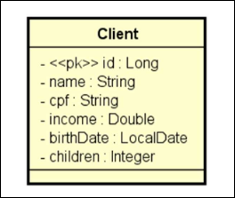

#  DESAFIO: CRUD de clientes 


### Desafio
Você deverá entregar um projeto ~~Spring Boot~~ Go contendo um CRUD completo de web services REST para
acessar um recurso de clientes, contendo as cinco operações básicas aprendidas no capítulo: </br>
- Busca paginada de recursos </br>
- Busca de recurso por id </br>
- Inserir novo recurso </br>
- Atualizar recurso </br>
- Deletar recurso </br>

### Especificação 
Um cliente possui nome, CPF, renda, data de nascimento, e quantidade de filhos. A especificação da
entidade Client é mostrada a seguir (você deve seguir à risca os nomes de classe e atributos mostrados no
diagrama):



**Seu projeto deverá fazer um seed de pelo menos 10 clientes** com dados SIGNIFICATIVOS (não é para
usar dados sem significado como “Nome 1”, “Nome 2”, etc.).</br>

**Seu projeto deverá tratar as seguintes exceções:**
- Id não encontrado (para GET por id, PUT e DELETE), retornando código 404.</br>
- Erro de validação, retornando código 422 e mensagens customizada para cada campo inválido. As
  regras de validação são: </br>
  - Nome: não pode ser vazio
  - Data de nascimento: não pode ser data futura (dica: use @PastOrPresent)

#### Endpoints a serem criados
###### Busca de cliente por id
```
GET /clients/1
```

###### Busca paginada de clientes
```
GET /clients?page=0&size=6&sort=name
```

###### Inserção de novo cliente
```
POST /clients
```
```json
{
  "name": "Maria Silva",
  "cpf": "12345678901",
  "income": 6500.0,
  "birthDate": "1994-07-20",
  "children": 2
}
```
###### Atualização de cliente
```
PUT /clients/1
```
```json
{
  "name": "Maria Silvaaa",
  "cpf": "12345678901",
  "income": 6500.0,
  "birthDate": "1994-07-20",
  "children": 2
}
```
###### Deleção de cliente
```
DELETE /clients/1
```

### Checklist
1. Busca por id retorna cliente existente</br>
2. Busca por id retorna 404 para cliente inexistente</br>
3. Busca paginada retorna listagem paginada corretamente</br>
4. Inserção de cliente insere cliente com dados válidos</br>
5. Inserção de cliente retorna 422 e mensagens customizadas com dados inválidos</br>
6. Atualização de cliente atualiza cliente com dados válidos</br>
7. Atualização de cliente retorna 404 para cliente inexistente</br>
8. Atualização de cliente retorna 422 e mensagens customizadas com dados inválidos</br>
9. Deleção de cliente deleta cliente existente</br>
10. Deleção de cliente retorna 404 para cliente inexistente</br>
